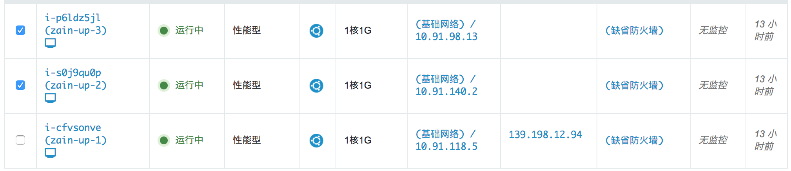
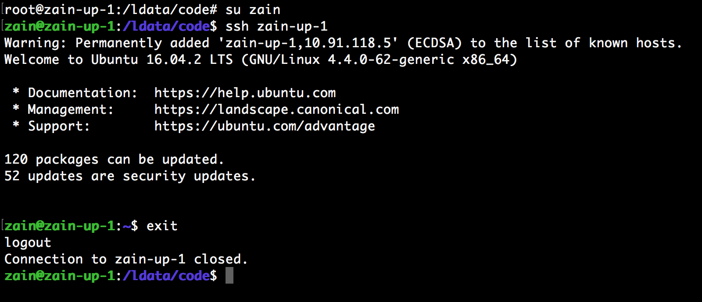
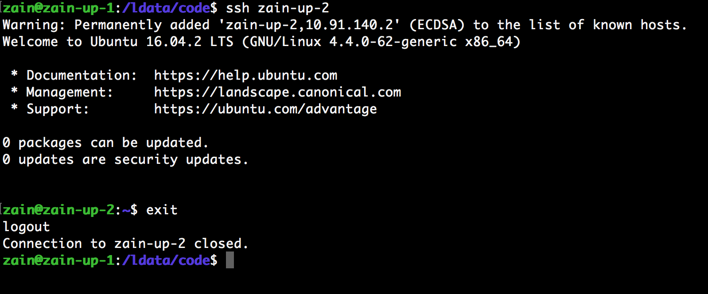
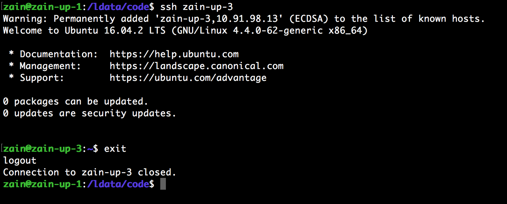
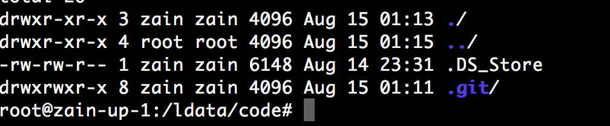

# 第一天作业

## 集群服务器  

> 三台服务器 - 青云  



> 登录zain-up-1
```
zain-up-1
ssh zain@139.198.12.94
密码：123456
```


> 关闭ssh远程密码登录
```
vim /etc/ssh/sshd_config
修改 PasswordAuthentication no
/etc/init.d/ssh restart
```

> 免密码登录zain-up-2
```
zain-up-2
登录 zain-up-1
ssh zain-up-2
```


> 免密码登录zain-up-3
```
zain-up-3
登录 zain-up-1
ssh zain-up-3
``` 


## git私服



> 目录结构
```
/ldata/code 根目录
|_ workspace/ 放分享或者暂存的东西
|  |_ 王子豪/ 个人文件夹
|  |_ .../ 其他人文件夹
|  ...
|
|_ homework/ 放需要提交的作业
|  |_ 王子豪/ 个人文件夹
|  |_ .../ 其他人文件夹
|  ...
|
...
```