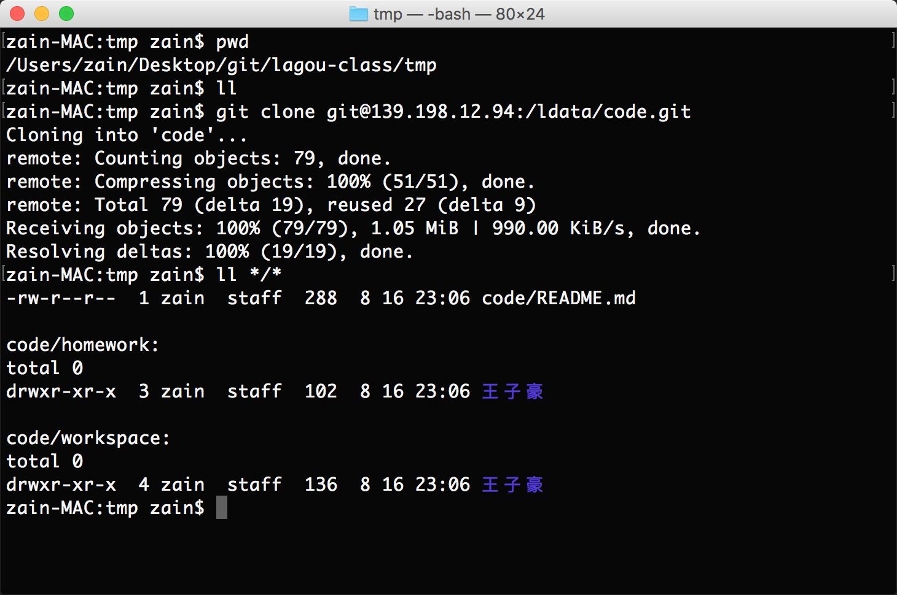

# 第二天作业

## git裸仓库  

> 建立git用户  


> 建立git裸仓库  


> clone裸仓库并上传文件  




## jdk管理
> jdk多版本


> ubuntu安装jenv管理java
```
sudo apt-get install zip // 安装解压软件
curl -s get.jenv.io | bash // 下载 jenv
source $HOME/.jenv/bin/jenv-init.sh
mkdir -p $HOME/.jenv/candidates/java
mv jdk1.8.0_144 $HOME/.jenv/candidates/java/1.8.0_144
jenv ls
jenv use java 1.8.0_144
```

