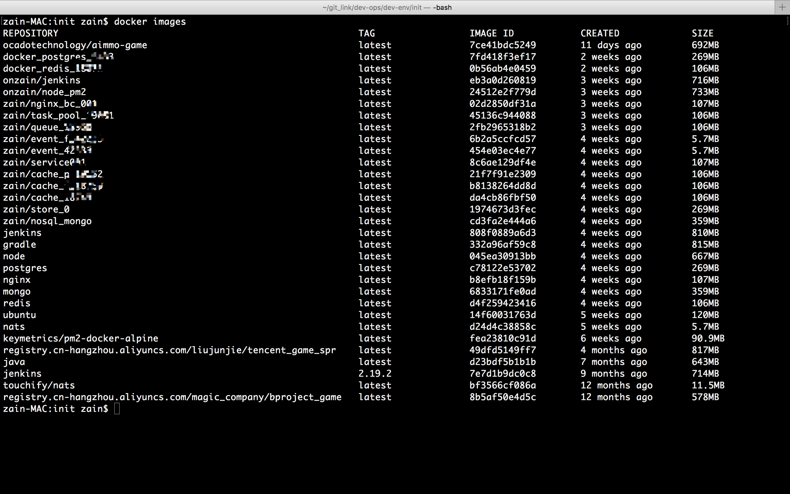

# 第三天作业

## docker项目

> docker制作的镜像


## 建模练习

> 枪手博弈
```
彼此痛恨的甲、乙、丙三个枪手准备决斗。甲枪法最好，十发八中；乙
枪法次之，十发六中；丙枪法最差，十发四中。

第一个问题：如果三人同时开枪，并且每人只发一枪；第一轮枪战
后，谁活下来的机会大一些？


// TODO 敬请期待
```

# 项目
```
见 src 只完成了一个Verticle
```
