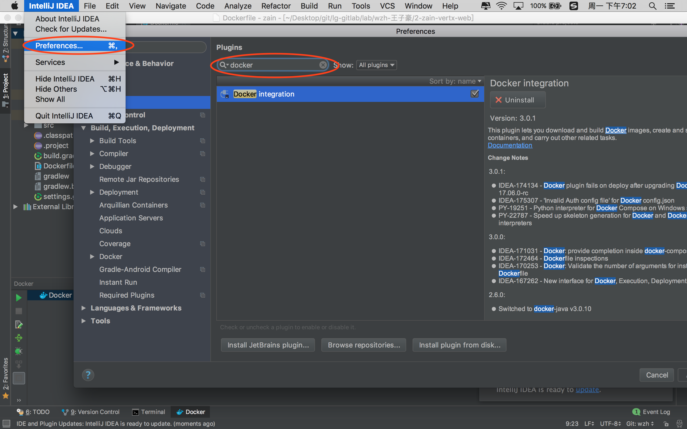
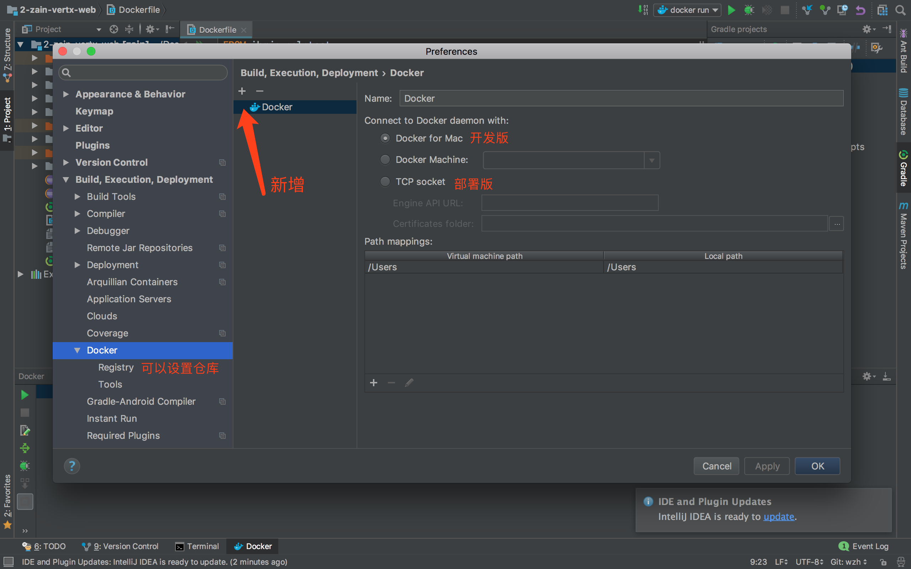
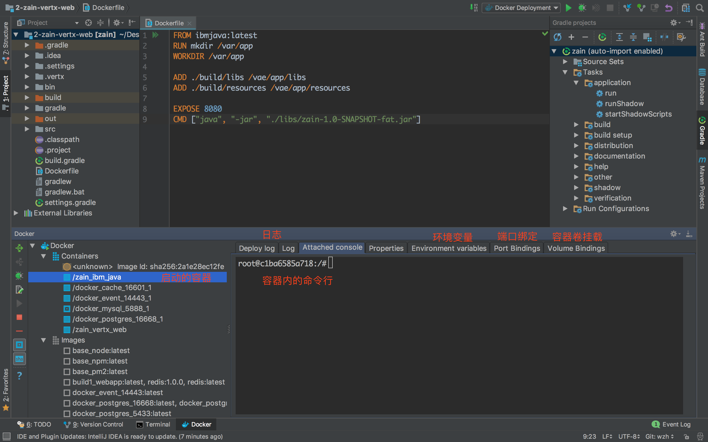
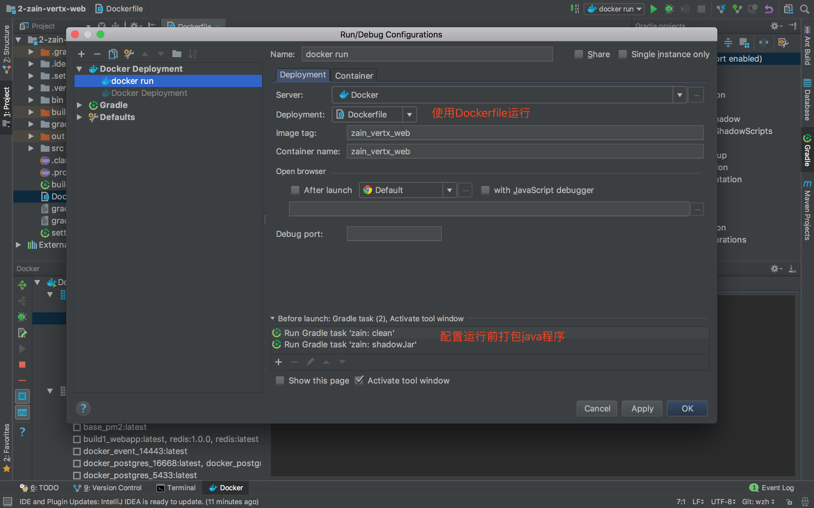

# hw-8th-1-1016

## intellij的docker插件使用  

> 插件安装位置  
 


> 插件使用  
 


> 运行容器    
 


> 通过Dockerfile运行项目  

```Dockerfile
FROM ibmjava:latest
RUN mkdir /var/app
WORKDIR /var/app

ADD ./build/libs /vae/app/libs
ADD ./build/resources /vae/app/resources

EXPOSE 8080
CMD ["java", "-jar", "./libs/zain-1.0-SNAPSHOT-fat.jar"]
```

 

> nginx Dockerfile  

``` Dockerfile
# nginx
FROM nginx:latest
WORKDIR /etc/nginx
ADD cert /cert
ADD conf.d conf.d
ADD public /var/www
EXPOSE 80
EXPOSE 443
CMD ["nginx", "-g", "daemon off;"]
```

> docker-compose  
```yml
version: "3"
services:
  web:
    build: ./Dockerfile-web
    network: 
      - webnet
  nginx:
    build: ./Dockerfile-nginx
    ports:
      - "80:80"
      - "443:443"
    volumes:
      - "/var/run/docker.sock:/var/run/docker.sock"
    deploy:
      placement:
        constraints: [node.role == manager]
    networks:
      - webnet
networks:
  webnet:
```