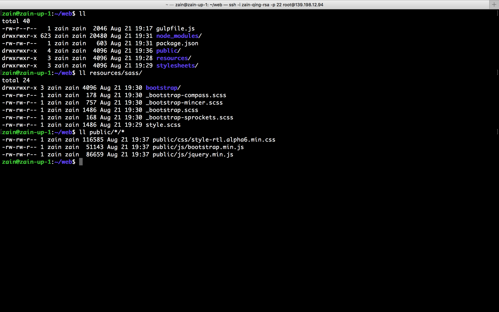
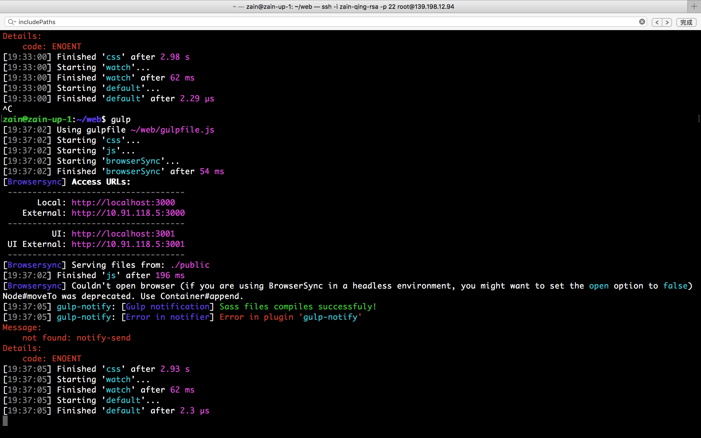
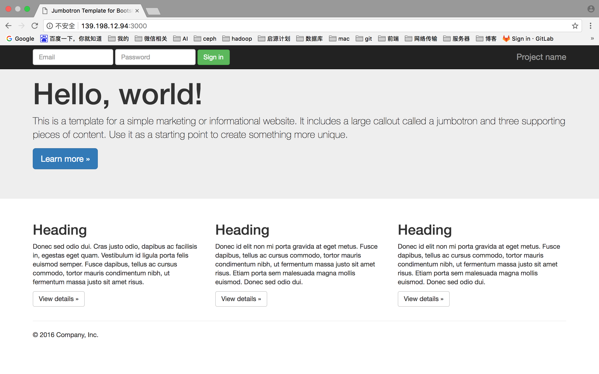

# 第三天作业

## glup编译并启动前端页面 

> 项目配置  



> 编译情况  



> 生成页面  




## 网络拓扑思考

```
北京 上海 武汉
120 270 450

VPN 内部连接
PPTP搭建局域网

权限划分
公司内部自己的权限
 运营 市场 销售 开发 售后 管理组

北京 运营 管理组
上海 市场 销售
武汉 开发 售后 销售

每个公司招聘计划年增长30%

网络拓扑 
5年 网络结构稳定

需要NAT 几个公网IP 局域网网段划分
三个分公司直接需要互通
```

// TODO 尽请期待

        北京  上海   武汉
第一年   120   270   450
       + 36  + 81  +135      
第二年   156   351   585