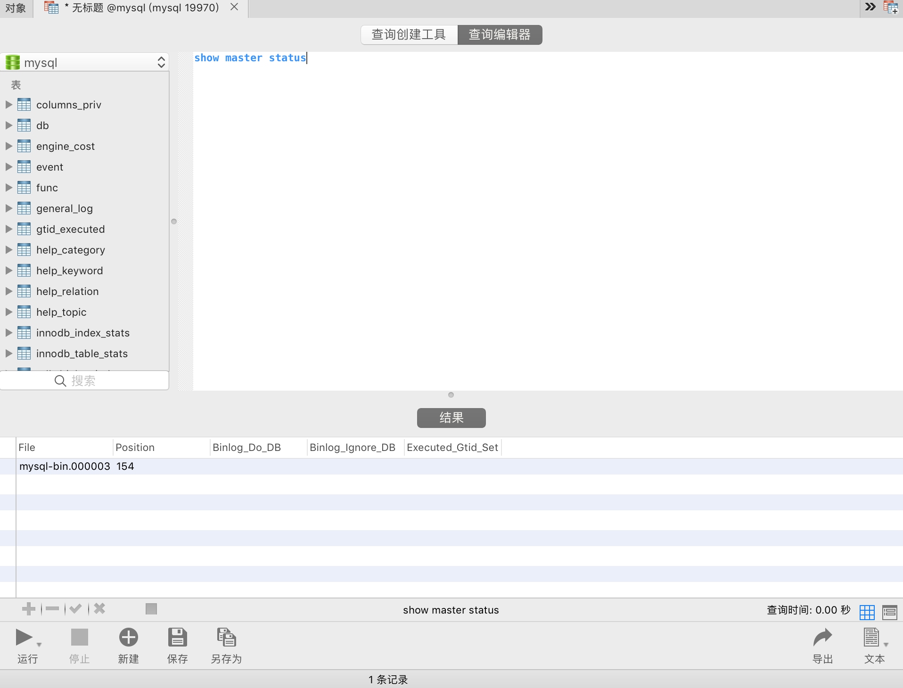
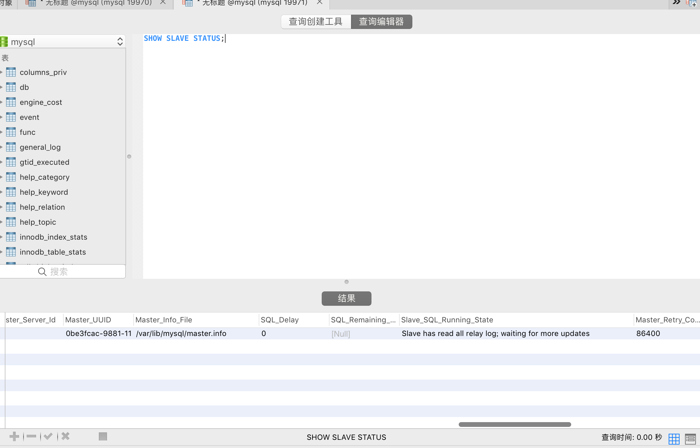

# mysql 主从配置

## docker 实践

> 启动容器    
```
docker-compose up -d
```

> 查看主库状态
```
启动后使用mysql客户端连接工具连接主库，打开mysql数据库
输入下面命令
SHOW MASTER STATUS;
```
 

> 主库创建用户, 创建从库同步数据使用的用户
```
CREATE USER 'slave_user'@'%' IDENTIFIED BY '123456';
```

> 设置用户权限
```
GRANT REPLICATION SLAVE ON *.* TO 'slave_user'@'%';
```

> 记录复制位置
```
FLUSH TABLES; -- 注：该条命令多次运行会刷新位置
SHOW MASTER STATUS;
```

> 怕不放心的可以锁定写 - 记得事后再解锁
```
FLUSH TABLES WITH READ LOCK;
SHOW MASTER STATUS;
```

> 可以尝试用新用户连接，看看通不通
```
mysql -h172.17.0.5 -uslave_user -p123456
```

> 使用mysql客户端连接工具连接从库，打开mysql数据库
```
CHANGE MASTER TO 
MASTER_HOST = '172.17.0.5', 
MASTER_USER = 'slave_user', 
MASTER_PASSWORD = '123456', 
MASTER_LOG_FILE = 'mysql-bin.000004', 
MASTER_LOG_POS = 609; 
```

> 启动主从复制
```
START SLAVE;
```

> 查看从库启动主从后的状态
```
SHOW SLAVE STATUS; // 看看有木有错误日志，或者没连接好的状态
```

> 登录主库，解锁写（如果之前锁的话）
```
UNLOCK TABLES;
```
 


## 资料

### 数据库主从配置
> 注意事项： 
```
多个mysql安装在不同服务器中，检查防火墙，确保服务器之间网络畅通,在开启主从同步前，确保从库和主库中的数据完全相同，通常将主库的数据文件直接打包复制到从库，如果使用虚拟机实验，配置直接复制虚拟机文件会更方便。
```

### 配置详情
> 安装mysql
```
apt-get update
apt-get install mysql-server mysql-client
配置my.cnf文件，设置服务器id，并开启binlog日志。（注意：mysql集群中的服务器id必须不同，大小从1到整形最大值）
```

> 主库设置
```
[mysqld] 
server-id=master_server_id 
log-bin=binlog_name 
```

> 从库设置
```
[mysqld] server-id=slave_server_id
```

> 创建从库同步数据使用的用户
```
CREATE USER 'slave_user'@'slave_host' IDENTIFIED BY 'slave_pass';
```

> 为用户分配权限
```
GRANT REPLICATION SLAVE ON *.* TO 'slave_user'@'slave_host';
```

> 连接到主服务器并通过执行 SHOW MASTER STATUS 语句确定当前的复制坐标:
```
FLUSH TABLES;
SHOW MASTER STATUS;
```

> 请记住 
```
File 和 Position 值(如file=mysql-bin.000001,postion=294),因为稍后还需要使用它们来告诉从服务器从哪个位置开始去读取 主服务器的二进制日志里的事件。重要注意事项 在主服务器上,在从确定其复制坐标到制作出将被传输到从服务器的初始复制的这 段时间里,一定要保证主服务器上的数据库里的数据没有发生任何修改。
在从服务器上为将被复制的数据库建立一份完备的副本。把主服务器上的数据库复制到从服务器以完成主、从服务器之间最初的同步。一种办法是先在主服务器主机上制作一份备份,再把这个 备份加载到从服务器上去;另一种办法是通过网络把各数据库从主服务器全部复制到从服务器。如果你还没有在主服务器上创建过任何数据库或数据表,可以省略这一步,因为它现在还没有任何需要复制的东西。
```

> 连接到从服务器并使用 CHANGE MASTER 语句来配置它,这包括把用来连接主服务器的参数和初始复制坐标告诉从服务器:
```
CHANGE MASTER TO MASTER_HOST = 'master_host', MASTER_USER = 'slave_user', MASTER_PASSWORD = 'slave_pass', MASTER_LOG_FILE = 'log_file_name', MASTER_LOG_POS = log_file_pos; 
masthost 是主服务器的主机名。slaveuser和slavepass值是刚才在主服务器创建 的那个账户的用户名和口令,从服务器将使用这个账户来连接主服务器并请求主服务器修改信息。 logfilename和logfilepos是刚才用 SHOW MASTER STATUS 语句查出来的值。 
在 Unix 系统上,使用 localhost 作为主机名将使用一个套接字文件去连接主服务器,但复制机 制不支持经套接字文件建立的连接。因此,如果主服务器和从服务器将运行在同一台主机上,就必须 把这个主机名写成 127.0.0.1 而不是 localhost,这样才能确保从服务器将使用 TCP/IP 连接。 
如果主服务器所监听的网络端口不是默认端口,可以在 CHANGE 语句里包括一个 MASTERPORT 选 项以明确地给出一个端口号。
```

> 启动主从复制
```
START SLAVE;
```

> 从服务器将连接主服务器并开始复制。
```
你可以在从服务器上使用 SHOW SLAVE STATUS 语句来查 看它的工作状态。 
从服务器把 CHANGE MASTER 语句所给出的参数保存在其数据目录中的一个名为 master.info 的 文件里以记录初始复制状态,并随着镜象工作的进展而刷新那个文件。等以后需要改变复制参数的时 候,只要连接到从服务器并通过 CHANGE MASTER 语句给出新的设置,从服务器就会根据新的设置自 动刷新 master.info 文件。 
保存在 master.info 文件里的信息包括用来连接主服务器的用户名和口令。这些信息应该是保 密的,所以应该把这个文件设置为只允许从服务器上的 MySQL 管理员的登录账户才能访问。
```

> 可以把 mysql 数据库排除在复制机制外,这需要做两件事情。
```
(1) 在把数据库的初始数据从主服务器传输到从服务器的时候,不要把 mysql 数据库也包括在 内。另一个办法是在传输之前先备份从服务器的 mysql 数据库,等传输工作完成后再恢复它。 
(2) 在从服务器的选项文件里加上以下代码,让它不要执行来自主服务器的对 mysql 数据库的任 何修改: 
[mysqld]
replicate-ignore-db=mysql
如果想让从服务器忽略多个数据库,需要多次使用 replicationignoredb 选项——每个数据库一次。
还有一个办法是在主服务器端(注意,不是从服务器端)使用--binlog-ignore-db 选项排除数据库。这个办法的优点是可以减少从主服务器传输到从服务器的信息量,缺点是主服务器上的二进制日志文件将不包含那些被排除在外的数据库的任何信息,而这些信息对主服务器在发生崩溃后的数据恢复工作往往至关重要。因此,在从服务器端把数据库排除在外的做法更值得选择。
```

> 重要命令
```
SHOW SLAVE STATUS语句。在从服务器上查看其复制机制是否在工作以及当前的复制坐标。复制坐标可以用来判断主服务器上的哪几个二进制日志文件已经不再会被用到了。    
PURGE MASTER语句。在主服务器上对二进制日志文件进行失效处理。在每一个从服务器上都通过SHOW SLAVE STATUS语句确定了哪些日志文件不会再用之后,你可以在主服务器上用这条语句把那些二进制日志文件删除掉。 
STOP SLAVE和START SLAVE语句。用来挂起和重新开始从服务器上的复制活动。比如说,当你制作备份时,可以用这些语句让从服务器暂时停止复制活动。
可以通过在 SLAVE STOP 或 SLAVE START 语句的末尾加上 IOTHREAD
或 SQLTHREAD 关键字的办法分别挂起或者重新开始这两个线程中的任何一个。
```

